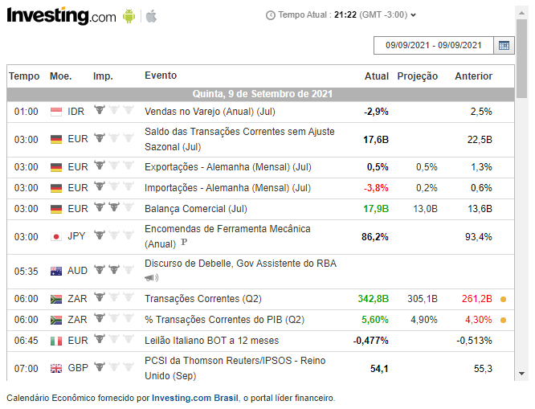

# Investing.com

My documentation of the url and params to form an embeded economic calendar from investing.com.

## Economic Calendar
https://br.investing.com/economic-calendar/


## Embeded HTML
Example of generated economic calendar iframe HTML code using the tool available at <https://br.investing.com/webmaster-tools/economic-calendar>.

```
<iframe 
    src="https://sslecal2.investing.com?
    columns=exc_flags,exc_currency,exc_importance,exc_actual,exc_forecast,exc_previous&
    features=datepicker,timezone&
    countries=110,17,29,25,32,6,37,36,26,5,22,39,14,48,10,35,7,43,38,4,12,72&
    calType=day&
    timeZone=12&
    lang=12" 
    width="650" 
    height="467" 
    frameborder="0" 
    allowtransparency="true" 
    marginwidth="0" 
    marginheight="0">
</iframe>

<div 
    class="poweredBy" style="font-family: Arial, Helvetica, sans-serif;">
        <span style="font-size: 11px;color: #333333;text-decoration: none;">
        Calendário Econômico fornecido por 
        <a 
            href="https://br.investing.com/" 
            rel="nofollow" 
            target="_blank" 
            style="font-size: 11px;color: #06529D; font-weight: bold;" class="underline_link">
                Investing.com Brasil
        </a>
        , o portal líder financeiro.
    </span>
</div>
```

### Result



## Query params

**BASE_URL** = https://sslecal2.investing.com
**COLUMNS** = [exc_flags,exc_currency,exc_importance,exc_actual,exc_forecast,exc_previous]

| Column name     | Description                                 |
|-----------------|---------------------------------------------|
| exc_flags       | Country flags shown before country currency |
| exc_currency    | Country currency                            |
| exc_importance  | Bull icon indicating expected volatility    |
| exc_actual      | Actual value of the economic indicator      |
| exc_forecast    | Forecast value of the economic indicator    |
| exc_previous    | Previous value of the economic indicator    |

**FEATURES** = [datepicker,timezone] 
**COUNTRIES** = [110,17,29,25,32,6,37,36,26,5,22,39,14,48,10,35,7,43,38,4,12,72]

| Numeric code      |Country          |
|-------------------|-----------------|
| 32                | Brazil          |
| 5                 | United States   |
| 110               | South Africa    |
| 7                 | Mexico          |
| 17                | Germany         | 
| 29                | Argentina       |
| 25                | Australia       |
| 6                 | Canada          |
| 37                | China           |
| 36                | Singapore       |
| 26                | Spain           |
| 22                | France          |
| 39                | Hong Kong       |
| 14                | India           |
| 48                | Indonesia       |
| 10                | Italy           |
| 35                | Japan           |
| 43                | New Zealand     |
| 38                | Portugal        |
| 4                 | United Kingdom  |
| 12                | Switzerland     |
| 72                | Euro Zone       |


**CALENDAR_TYPE** = 'day' or 'week'

| Value| Description         |
|------|---------------------|
| day  | Events of the day   |
| week | Events of the week  |

**TIME_ZONE** = 12
**LANGUAGE** = 12 

### Style (iframe)
width="650" (Default) Minimum value to avoid break layout 600 (with all available columns).
height="467"(Default) Minimum recommended value is 150. With this value is possible to view table header and the first row. Height of each table row is 25.
frameborder="0" 
allowtransparency="true" 
marginwidth="0" 
marginheight="0"

## Example of a small economic calendar
In this example the ideia was to see the economic events of the DAY of the selected country UNITED STATES with the features DATEPICKER and TIMEZONE, defining specific WIDTH and HEIGHT and a iframe without BORDER.
### Code

```
<iframe 
    src="https://sslecal2.investing.com?
    columns=&
    features=datepicker,timezone&
    countries=5&
    calType=day&
    timeZone=12&
    lang=12" 
    width="460" 
    height="150" 
    frameborder="0">
</iframe>
```

### Result


